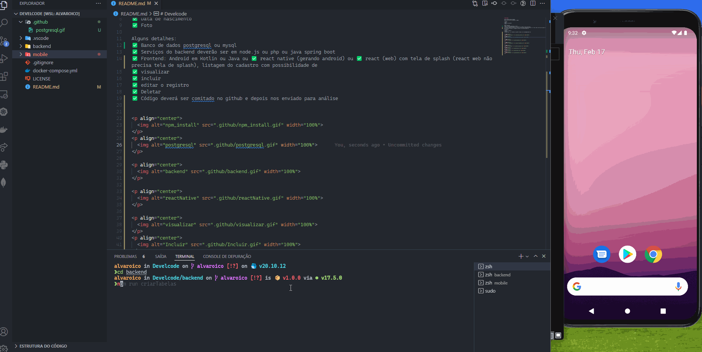
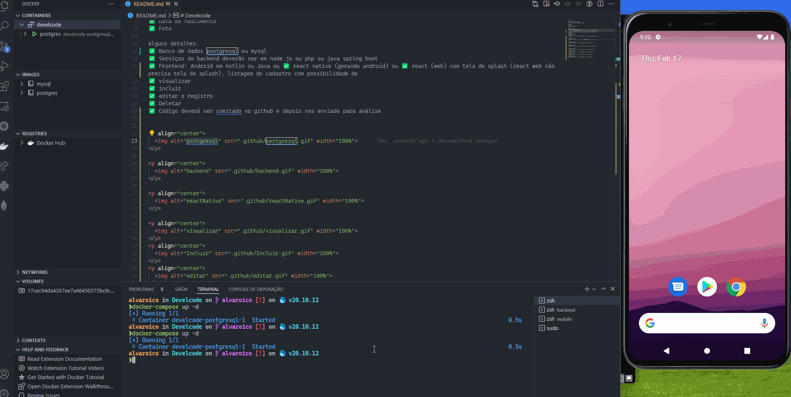
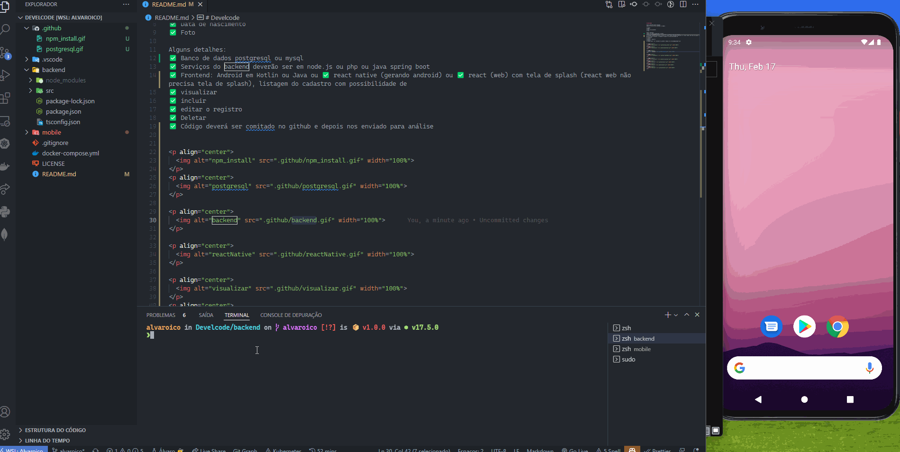
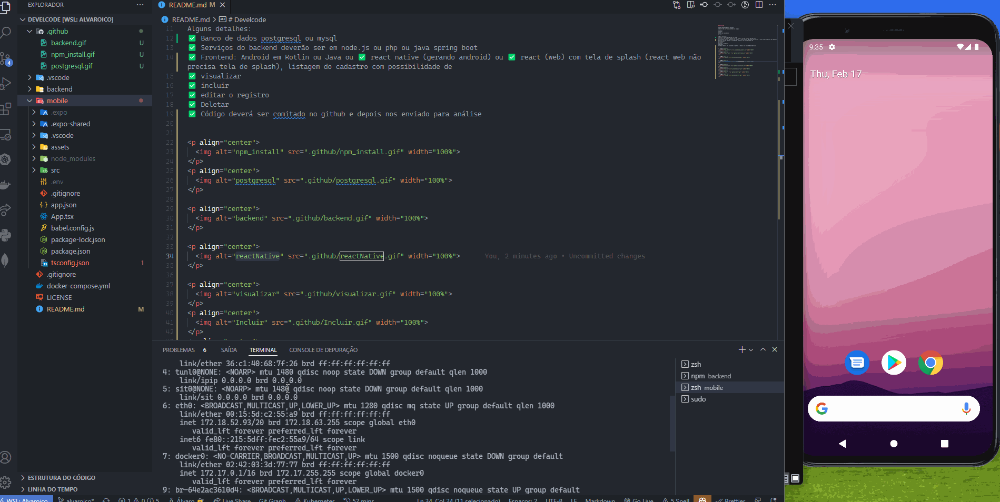
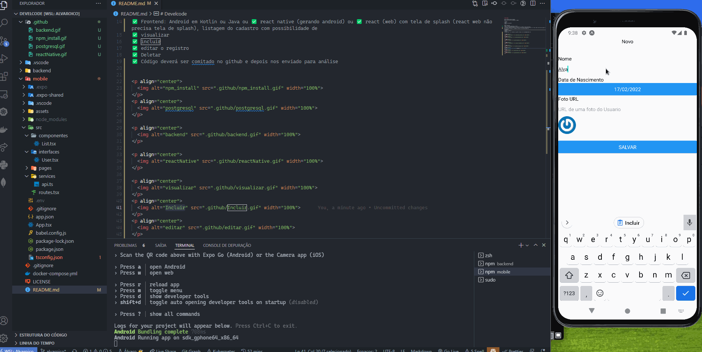
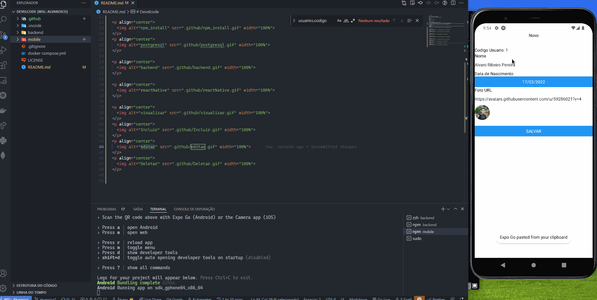
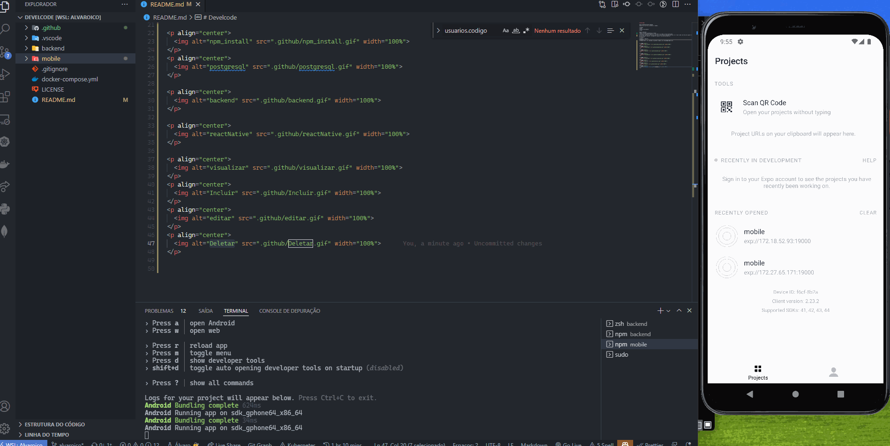

# Develcode

TESTE CADASTRO BÁSICO USUÁRIO
Cadastro de usuários contendo os campos:

✅ Código
✅ Nome
✅ Data de nascimento
✅ Foto

Alguns detalhes:

✅ NPM Install

  

✅ Banco de dados postgresql ou mysql

  

✅ Serviços do backend deverão ser em node.js ou php ou java spring boot

  

✅ Frontend: Android em Kotlin ou Java ou ✅ react native (gerando android) ou ✅ react (web) com tela de splash (react web não precisa tela de splash), listagem do cadastro com possibilidade de 

  

✅ visualizar

  

✅ incluir

  

✅ editar o registro

  

✅ Deletar

  

✅ Código deverá ser comitado no github e depois nos enviado para análise

